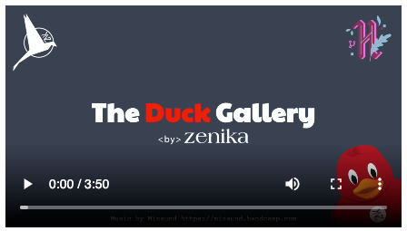

[](./LICENSE.md)

The main goal of "The Duck Gallery" is to propose an easy and fun way to make your first contribution on an open source project.

Here is the official website: https://theduckgallery.zenika.com.

It's open to everyone. Happy Hacktoberfest!


## Contributing

First of all, to contribute, you must agree with our [code of conduct](./.github/CODE_OF_CONDUCT.md).

Then it's time to add your duck ;)

### The easy way to contribute

Here you just need a GitHub account (don't forget to register to Hacktoberfest if you want a PR count).

Then follow the steps shown in [this video](https://theduckgallery.zenika.com/howto):

[](https://theduckgallery.zenika.com/howto)

### The developer way to contribute

1. Go to https://pimpmyduck.zenika.com and create your own duck.
2. Export it to an image (use the ***download*** button).
3. Fork [this repository](https://github.com/zenika-open-source/the-duck-gallery). Go to your GitHub account, open the forked repository.
4. Click on the ***Code*** button and then click the copy to clipboard icon.
   Open a terminal and run the following git command:

> git clone "**url you just copied**"

5. Change to the repository directory on your computer (if you are not already there):

> cd the-duck-gallery

6. Now create a branch using the git switch command:

> git switch -c **your-new-branch-name**

7. Add your image into the `ducks/` folder, with your GitHub username as filename (ex: `your-username.png`).
8. Into the `contributors.js` file add a line with your GitHub username and a short message.

```js
  { username: 'your-username', message: 'Say something kind or fun' },
```

6. Commit and push your modifications.

> git push origin -u **your-branch-name**

7. Create a PR.

That's it :tada: We will review and merge it if everything is OK :+1:

Once your PR is merged, you will be able to see it here:

https://theduckgallery.zenika.com


**Be careful, your PR must respect the following conditions:**

1. Your contribution must respect the [code of conduct](./.github/CODE_OF_CONDUCT.md).
1. It's your first PR to this repository.
1. You have added your image of the duck downloaded from https://pimpmyduck.zenika.com.
1. You have not changed the image of the duck.
1. The image filename must be your GitHub username (ex: `your-username.png`).
1. You are using your own GitHub user and it's the same as the PR author.
1. Into the `contributors.js` file, the message must be short and respect the [code of conduct](./.github/CODE_OF_CONDUCT.md).


## License

This project is [Apache-2.0](./LICENSE.md) licensed.<br />
Copyright © 2020-2022 [Zenika](https://oss.zenika.com).


